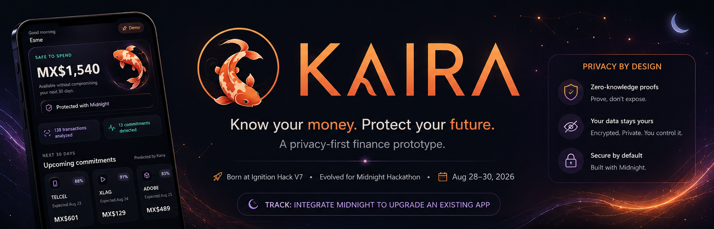

<p align="center">
  
</p>

# Kaira

**Know your money. Protect your future.**

Kaira is a privacy-first personal finance prototype designed to help users understand how much of their current balance is actually safe to spend before future commitments are affected.

Traditional banking interfaces usually show what is available **right now**. That number does not necessarily represent what is truly disposable once recurring payments, upcoming expenses, savings goals, and safety buffers are considered.

Kaira adds a forward-looking financial decision layer and now uses **Midnight zero-knowledge technology** to verify financial conditions without disclosing the raw financial inputs on-chain.

> **Kaira asks a different question:**  
> *How much can I spend without compromising what comes next?*

---

## Hackathon Evolution

Kaira was originally created at **Ignition Hack V7**.

The project was later evolved for the **Midnight Hackathon, August 28–30, 2026**, with a focus on upgrading an existing application with meaningful privacy and security guarantees.

### Track alignment

- **Integrate Midnight Track Resources**  
  Kaira adds private zero-knowledge verification to an existing financial decision engine using Midnight resources.

The goal was not to rebuild Kaira from scratch. The goal was to make the existing product more trustworthy by introducing explicit privacy boundaries and verifiable financial policies.

---

## Problem

A bank balance does not represent true spending capacity.

Part of that balance may already be effectively committed to:

- recurring payments;
- subscriptions;
- upcoming expenses;
- savings goals;
- financial safety margins.

This creates a gap between:

```text
Current balance
      ≠
Actually safe-to-spend money
```

Kaira is designed around closing that gap.

---

## Solution

Kaira combines financial activity, recurring-payment detection, upcoming commitments, savings protection, and purchase simulation into a forward-looking decision layer.

```text
Current Balance
      |
      +-- Upcoming Commitments
      +-- Reserved Savings
      +-- Safety Buffer
      |
      v
Safe-to-Spend
      |
      v
Purchase Simulation
      |
      +-- Safe
      +-- Warning
      +-- High Risk
```

Instead of asking only:

> How much money do I have?

Kaira asks:

> How much can I spend without affecting what comes next?

---

# Core Features

## Safe-to-Spend Calculation

Kaira calculates a more realistic spending limit using:

- current balance;
- upcoming commitments;
- protected savings;
- configured safety buffer.

At a high level:

```text
Safe-to-Spend
=
Current Balance
- Upcoming Commitments
- Reserved Savings
- Safety Buffer
```

---

## Recurring Payment Detection

Transaction data is analyzed to identify recurring charges and expected future payments.

Detected recurring expenses are used to forecast upcoming commitments rather than treating previous transactions as isolated events.

---

## Upcoming Expense Forecasting

Kaira projects detected recurring payments into the near future so the application can reason about money that exists today but is likely needed soon.

---

## Subscription Controls

Recurring payments can be reviewed and managed individually to improve visibility over automatic charges and reduce surprise renewals.

---

## Savings Goals

Users can reserve money for goals.

Reserved funds are excluded from available spending capacity and can be:

- created;
- funded;
- moved between goals;
- released.

A high-risk purchase can also be redirected into a savings goal from Kaira Guard.

---

## Purchase Simulator

The purchase simulator evaluates the impact of a hypothetical purchase before it is made.

It compares:

- Safe-to-Spend before the purchase;
- proposed purchase amount;
- projected Safe-to-Spend after the purchase;
- upcoming commitments;
- configured safety buffer.

The result is classified as:

```text
Safe
Warning
High Risk
```

---

## Kaira Guard

Kaira Guard is the protection layer around the purchase simulator.

The browser submits only the proposed purchase information. The authoritative financial assessment is calculated on the server using Kaira's account, transaction, recurring-payment, forecasting, and savings data.

For high-risk purchases, Kaira can:

- generate a recommendation;
- trigger the configured n8n workflow;
- persist a protected Guard event;
- attach Midnight transaction metadata;
- offer a path to convert the purchase into a savings goal.

Safe and warning simulations do not create high-risk Guard events.

---

## Voice Warnings

For high-risk scenarios, Kaira can generate an audible warning using **ElevenLabs**, extending financial alerts beyond the visual dashboard.

---

## Automation Workflows

Kaira uses **n8n** for supporting automation and recommendation workflows in the prototype.

---

# Midnight Privacy Upgrade

The Midnight integration adds two privacy-preserving verification flows:

1. **Kaira Private Guard**
2. **Private Financial Identity**

Both use Compact circuits with private inputs and disclose only the verification result required by the application.

---

## 1. Kaira Private Guard

Purchase safety is verified using private financial values.

The Compact circuit receives:

```text
currentBalance
upcomingCommitments
reservedSavings
safetyBuffer
purchaseAmount
```

It evaluates:

```text
currentBalance
>=
upcomingCommitments
+ reservedSavings
+ safetyBuffer
+ purchaseAmount
```

The raw values are private circuit inputs.

The contract discloses only the resulting boolean eligibility state.

### What this means

Kaira can prove that a proposed purchase satisfies the configured financial safety policy without publishing the exact:

- account balance;
- upcoming commitments;
- reserved savings;
- safety buffer;
- purchase amount

to the Midnight public state.

> The Kaira application server still processes the values required to perform the verification. The privacy guarantee described here is specifically about what is disclosed by the Midnight contract/on-chain verification flow.

---

## 2. Private Financial Identity

Kaira also demonstrates financial eligibility verification for three profile types:

```text
Own income
Financially dependent adult
Minor with guardian
```

The user can verify a financial profile without persisting the exact income or age in the financial identity profile.

### Own-income profile

The circuit checks private predicates such as:

```text
age >= 18
monthlyIncome >= minimumRequiredIncome
incomeSourceVerified
taxCompliant
```

### Financially dependent adult

The circuit checks:

```text
age >= 18
supporterMonthlyIncome >= minimumRequiredIncome
supporterVerified
relationshipVerified
supporterTaxCompliant
```

### Minor with guardian

The circuit checks:

```text
age < 18
guardianMonthlyIncome >= minimumRequiredIncome
guardianVerified
relationshipVerified
guardianTaxCompliant
```

Only the resulting verification state is disclosed by the contract.

---

## Identity Proof Persistence

After verification, Kaira persists proof metadata such as:

```text
profile_type
midnight_verified
midnight_transaction_id
midnight_block_height
verified_at
```

The financial identity profile intentionally does **not** persist:

```text
exact income
exact age
guardian income
supporter income
financial documents
tax/compliance details
```

This creates a simple product rule:

> **Kaira stores the proof result, not the financial secret.**

---

# AI-Assisted Privacy Direction

Kaira's AI-assisted privacy concept is based on reducing the amount of private financial information an AI-assisted workflow needs to receive.

Instead of sending raw financial records to a model, the application can use a verified result:

```text
Private financial data
        |
        v
Midnight policy verification
        |
        v
verified = true / false
        |
        v
AI-assisted Kaira workflow
```

The goal is to let downstream AI-assisted experiences act on a trusted financial signal while minimizing unnecessary exposure of the private source values.

### Current prototype boundary

The hackathon prototype uses **server-controlled demo attestations** for credential flags such as income-source verification, guardian verification, relationship verification, and compliance status.

These demo attestations are not equivalent to production credentials issued by a bank, tax authority, employer, or government institution.

A production implementation would replace the demo source with cryptographically verifiable credentials or trusted signed attestations.

---

# Privacy Model

## Private in Midnight verification

### Purchase Guard

- current balance;
- upcoming commitments;
- reserved savings;
- safety buffer;
- proposed purchase amount.

### Private Financial Identity

Depending on profile type:

- age;
- own income;
- supporter income;
- guardian income;
- configured minimum-income threshold;
- credential predicates supplied to the circuit.

## Disclosed by the Compact contract

The circuits disclose only the required boolean verification result.

Kaira additionally surfaces transaction metadata such as:

- Midnight transaction ID;
- block height;
- profile type where applicable.

---

# Data Persistence Boundaries

Kaira intentionally separates application data from Midnight disclosure.

## Guard events

A **high-risk** Guard event may persist application-level context including:

- purchase name;
- purchase amount;
- risk level;
- projected Safe-to-Spend after the purchase;
- upcoming expenses;
- Midnight verification result;
- Midnight transaction ID;
- Midnight block height.

This information is stored by Kaira/Supabase for the Guard workflow. It is not the same as on-chain disclosure by the Compact circuit.

## Financial identity profiles

The identity table stores proof metadata only and intentionally excludes raw identity financial values.

---

# Security Model

The implemented prototype includes:

- server-authoritative purchase-risk calculation;
- private Compact circuit inputs;
- explicit `disclose(...)` boundaries;
- server-controlled demo credential flags;
- proof transaction metadata;
- high-risk-only Guard event persistence;
- financial identity proof metadata without raw income/age persistence;
- local Midnight bridge isolation from the browser;
- no wallet seed phrase or private key committed to the repository.

---

# Prototype Security Limitations

Kaira is a hackathon prototype and has **not** undergone a production security audit.

Important limitations:

- the prototype does not connect to real banking accounts;
- the prototype does not execute real banking transactions;
- private financial claims entered during the identity demo are not independently certified by a financial institution;
- server-controlled demo attestations are not cryptographically signed issuer credentials;
- the Midnight proof verifies the configured computation over the supplied private inputs, not the real-world origin of those inputs;
- production authentication, authorization, key management, credential issuance, compliance controls, and security review are outside the current prototype scope.

A production implementation would require trusted data sources and signed credentials from appropriate issuers.

---

# Not a Financial Institution

Kaira is an experimental software prototype.

It is not a bank, financial institution, investment advisor, payment processor, or financial service provider.

The application does not currently hold, custody, transmit, or move real user funds.

---

# System Architecture

```text
                            KAIRA
                              |
             +----------------+----------------+
             |                                 |
             v                                 v
      Purchase Guard                Private Financial Identity
             |                                 |
             | authoritative                    | private claims
             | finance state                    | + server attestations
             v                                 v
        Next.js API                        Next.js API
             |                                 |
             +----------------+----------------+
                              |
                              v
                       Midnight Bridge
                      127.0.0.1:8787
                              |
                              v
                       Compact Contract
                         Private Inputs
                              |
                              v
                    Zero-Knowledge Proof
                              |
                              v
                 boolean result + tx + block
                              |
                  +-----------+-----------+
                  |                       |
                  v                       v
               Kaira UI               Supabase
                                  proof / event metadata
```

---

# Purchase Guard Flow

```text
Browser
  |
  | purchase name + amount
  v
POST /api/guard
  |
  | load authoritative account data
  | detect recurring payments
  | forecast commitments
  | calculate reserved savings
  | evaluate risk
  v
Kaira financial engine
  |
  v
Midnight Private Guard
  |
  v
Compact verifyPurchase
  |
  +-- verified = true  -> Safe/Warning response
  |
  +-- verified = false -> High-risk Guard workflow
                            |
                            +-- n8n recommendation
                            +-- Guard event
                            +-- Add to Goals
```

---

# Private Financial Identity Flow

```text
/profile
   |
   v
/identity
   |
   | private claims
   v
POST /api/private-identity
   |
   | server-controlled demo attestations
   v
Midnight Bridge
   |
   v
Compact identity circuit
   |
   v
verified = true / false
   |
   +-- tx ID
   +-- block height
   |
   v
Supabase
proof metadata only
```

---

# Technology

## Frontend

- Next.js 16
- React
- TypeScript
- Tailwind CSS
- Lucide React

## Backend & Data

- Next.js API routes
- Supabase
- custom financial data models
- recurring-payment detection
- financial forecasting
- Safe-to-Spend engine
- purchase-risk / collision engine

## Privacy & Security

- Midnight Network
- Compact
- Midnight.js
- Midnight Wallet SDK
- zero-knowledge proof server
- local Midnight bridge

## Automation

- n8n

## Voice & AI-Assisted Workflows

- ElevenLabs
- AI-assisted development and recommendation workflows

---

# Project Structure

```text
Kaira/
├── kaira/
│   ├── app/
│   │   ├── activity/
│   │   ├── api/
│   │   │   ├── guard/
│   │   │   ├── private-identity/
│   │   │   ├── goals/
│   │   │   └── voice-warning/
│   │   ├── guard/
│   │   ├── identity/
│   │   ├── profile/
│   │   └── goals/
│   │
│   ├── components/
│   │   ├── kaira/
│   │   └── purchase-simulator.tsx
│   │
│   ├── lib/
│   │   ├── data/
│   │   ├── engines/
│   │   ├── midnight/
│   │   │   ├── private-guard.ts
│   │   │   └── private-identity.ts
│   │   ├── supabase/
│   │   ├── types/
│   │   └── utils/
│   │
│   └── public/
│       ├── Banner.png
│       └── kaira-koi.png
│
└── midnight/
    └── kaira-private-guard/
        ├── contracts/
        │   └── kaira-private-guard.compact
        ├── scripts/
        │   └── e2e-check.ts
        └── src/
            ├── deploy.ts
            └── server.ts
```

---

# Running the Project

## Requirements

- Node.js 22+
- npm
- Docker / Docker Compose
- Compact compiler
- Supabase project/configuration for the Kaira application

The Midnight project is currently configured for a local development network by default.

---

## 1. Start Midnight services

```bash
cd midnight/kaira-private-guard
npm install
docker compose up -d
```

Compile the Compact contract:

```bash
npm run compile
```

For a fresh local deployment:

```bash
npm run deploy
```

Start the Midnight bridge:

```bash
npm run server
```

Health check:

```bash
curl http://127.0.0.1:8787/health
```

The bridge exposes:

```text
POST /verify
POST /verify-identity
GET  /health
```

---

## 2. Start Kaira

In another terminal:

```bash
cd kaira
npm install
npm run dev
```

Open:

```text
http://localhost:3000
```

Useful demo routes:

```text
/guard
/profile
/identity
/goals
```

---

# Validation

## Kaira TypeScript

```bash
cd kaira
npx next typegen
npx tsc --noEmit
```

## Midnight transactional E2E

```bash
cd midnight/kaira-private-guard
npm run test:e2e
```

The E2E check validates:

```text
contract connection
public state read
ZK proof generation
transaction submission
state transition
```

---

# Verified Prototype Behaviors

The current prototype has been manually validated for:

```text
Purchase Guard
safe purchase       -> Midnight verified true
high-risk purchase  -> Midnight verified false + Guard event

Private Financial Identity
own income / valid        -> verified true
own income / insufficient -> verified false
dependent adult           -> verified true
minor + guardian          -> verified true
```

The exact transaction IDs and block heights vary by local devnet run.

---

# Project Provenance

Kaira maintains its evolution through Git.

Important milestones include:

```text
v0.1-before-midnight
Kaira before the Midnight integration

v0.2-midnight
Kaira with Midnight privacy/security upgrades
```

### Hackathon history

- **Ignition Hack V7** — original Kaira prototype.
- **Midnight Hackathon, August 28–30, 2026** — privacy/security evolution.

---

# AI-Assisted Development

Artificial intelligence tools were used as development assistants during the hackathon.

AI assistance included:

- architecture exploration;
- code drafting and review;
- debugging support;
- documentation drafting;
- security analysis;
- development planning;
- visual ideation.

All product decisions, implementation choices, integration work, testing, and final project submission are reviewed and directed by the project author/team.

See [`AI_USAGE.md`](./AI_USAGE.md) for the detailed disclosure.

---

# Documentation

- [`AI_USAGE.md`](./AI_USAGE.md) — AI tooling and responsible usage.
- [`SECURITY.md`](./SECURITY.md) — security model, assumptions, and limitations.
- [`COPYRIGHT.md`](./COPYRIGHT.md) — copyright, attribution, and original assets.
- [`LICENSE`](./LICENSE) — software license.

---

# Responsible Security Disclosure

If you discover a security issue in Kaira, please do not publish sensitive exploit details in a public GitHub issue.

Contact:

```text
esmeentb@gmail.com
```

Please include:

- a description of the issue;
- steps to reproduce it;
- affected components;
- potential impact.

This prototype should never be tested against real financial accounts, real funds, or third-party infrastructure without authorization.

---

# Future Development

Kaira started as a hackathon prototype, but the long-term vision goes beyond a demo.

The goal is to evolve Kaira into an accessible personal finance application that can be useful to a broad range of people, regardless of their financial background or technical knowledge.

A future version of Kaira would aim to be:

- useful for everyday financial decision-making;
- accessible and easy to understand;
- available at little or no cost to users whenever possible;
- privacy-first by design;
- secure enough to handle sensitive financial workflows responsibly;
- compatible with regulated banking and financial ecosystems.

Long-term development could include partnerships or integrations with banks, regulated financial institutions, and appropriate government or compliance systems where legally required.

The purpose of those integrations would not be to give Kaira unnecessary access to user information, but to allow financial claims, credentials, and transactions to be verified through legitimate and regulated sources.

### Future work may include:

- real banking integrations;
- automatic transaction synchronization;
- stronger authentication and authorization;
- encrypted financial storage;
- institution-issued financial credentials;
- additional Midnight zero-knowledge proofs;
- production-grade key management;
- more advanced fraud and financial-risk protection;
- improved recurring-payment detection;
- subscription management and cancellation workflows;
- longer-term cash-flow forecasting;
- adaptive Safe-to-Spend recommendations;
- smarter savings automation;
- accessibility improvements;
- localization for different users and regions;
- completion of the remaining planned Kaira features;
- independent security reviews and production audits.

The long-term ambition is for Kaira to become more than a dashboard: a financial companion that helps people make safer decisions while revealing as little sensitive information as possible.
---

# License & Copyright

See [`COPYRIGHT.md`](./COPYRIGHT.md) for copyright, attribution, project branding, and original visual assets.

Third-party frameworks, SDKs, libraries, and services remain subject to their respective licenses and terms.

---

# Status

**Midnight Hackathon prototype — August 28–30, 2026.**

Current implemented scope includes:

- Safe-to-Spend financial logic;
- recurring-payment detection;
- upcoming commitment forecasting;
- savings management;
- purchase simulation;
- Kaira Guard;
- high-risk workflow automation;
- voice warnings;
- Supabase-backed application data;
- Midnight private purchase verification;
- Private Financial Identity;
- server-controlled demo attestations;
- proof metadata persistence;
- transactional Midnight E2E verification.

**Privacy by design. Verify without revealing.**

---
# Coming Soon (Hopefully...)

Kaira is still evolving

There are still features I would love to finish, ideas I want to explore, and a lot of room to make Kaira safer, more useful, and more accessible.

Maybe this stays a hackathon prototype.

Maybe it becomes something bigger.

Maybe one day it even launches publicly.

Who knows? :3

**Stay tuned for future features, experiments, and whatever Kaira becomes next.**


```bash
⠀⠀⠀⠀⠀⠀⠀⠀⠀⠀⠀⠀⢀⣴⡆⠀⠀⠀⠀⠀⠀⠀⠀⠀⠀⠀⠀⠀⠀⠀⠀⠀⠀⠀⠀⠀⠀⠀⠀⠀⠀⠀⠀⠀⠀⠀
⠀⠀⠀⠀⠀⠀⠀⠀⠀⠀⠀⢀⣾⣿⣧⠀⠀⠀⠀⠀⠀⠀⠀⠀⠀⠀⠀⠀⠀⠀⠀⠀⠀⠀⠀⠀⠀⠀⠀⠀⠀⠀⠀⠀⠀⠀
⠀⠀⠀⠀⠀⠀⠀⠀⠀⠀⢀⣾⣿⣿⣿⠀⠀⠀⠀⠀⠀⠀⠀⠀⠀⠀⠀⠀⠀⠀⠀⠀⠀⠀⠀⠀⠀⠀⠀⠀⠀⠀⠀⠀⠀⠀
⠀⠀⠀⠀⠀⠀⠀⠀⠀⠀⡾⠋⠉⠀⡇⠀⠀⠀⠀⠀⠀⠀⠀⠀⠀⠀⠀⠀⠀⠀⠀⠀⠀⠀⠀⠀⠀⠀⠀⠀⠀⠀⠀⠀⠀⠀
⠀⠀⠀⠀⠀⠀⠀⠀⠀⣼⠃⠀⠀⠀⡇⠀⠀⠀⠀⠀⠀⣠⠖⠲⢤⡖⠒⣆⠀⠀⠀⠀⠀⠀⠀⠀⠀⠀⠀⠀⠀⠀⠀⠀⠀⠀
⠀⠀⠀⠀⠀⠀⠀⠀⢀⡏⠀⠀⠀⠀⡇⠀⠀⠀⠀⠀⠀⡏⠀⠀⠀⠀⠀⢀⡇⠀⠀⠀⠀⠀⠀⠀⠀⠀⠀⠀⠀⠀⠀⠀⠀⠀
⠀⠀⠀⠀⢀⣀⠀⠀⢸⠀⠀⠀⠀⠀⡇⠀⠀⠀⠀⠀⠀⠸⣄⠀⠁⣠⠞⠉⠀⠀⠀⠀⠀⠀⠀⠀⢀⣀⣀⣠⣤⣤⣤⣤⠀⠀
⠀⡞⠉⠻⠁⢹⠀⠀⡏⠀⠀⠀⠀⢸⠃⠀⠀⠀⠀⠀⠀⠀⠀⠹⣶⠋⠀⠀⠀⠀⣀⡤⠴⠒⠊⠉⠉⠀⠀⣿⣿⣿⠿⠋⠀⠀
⠀⠳⢤⡀⠀⡞⠁⠀⡇⠀⠀⢀⡠⠼⠴⠒⠒⠒⠒⠦⠤⠤⣄⣀⠀⢀⣠⠴⠚⠉⠀⠀⠀⠀⠀⠀⠀⠀⣼⠿⠋⠁⠀⠀⠀⠀
⠀⠀⠀⠈⠷⡏⠀⠀⣇⠔⠂⠈⠀⠀⠀⠀⠀⠀⠀⠀⠀⠀⠀⢨⠿⠋⠀⠀⠀⠀⠀⠀⠀⠀⣀⡤⠖⠋⠁⠀⠀⠀⠀⠀⠀⠀
⠀⠀⠀⠀⠀⠀⠀⢰⠋⠀⠀⠀⠀⠀⠀⠀⠀⠀⠀⠀⠀⠀⠀⠀⠀⠀⠀⠀⠀⣀⣠⠤⠒⠋⠁⠀⠀⠀⠀⠀⠀⠀⠀⠀⠀⠀
⠀⠀⠀⠀⠀⠀⢀⡟⠀⣠⣄⡀⠀⠀⠀⠀⠀⠀⠀⠀⠀⠀⠀⠀⠀⠀⠈⠉⢻⠁⠀⠀⠀⠀⠀⠀⠀⠀⠀⢀⣠⣤⣤⡤⠤⢴
⠀⠀⠀⠀⠀⠀⣸⠁⣾⣿⣀⣽⡆⠀⠀⠀⠀⠀⠀⠀⢠⣾⠉⢿⣦⠀⠀⠀⢸⡀⠀⠀⢀⣠⠤⠔⠒⠋⠉⠉⠀⠀⠀⠀⢀⡞
⠀⠀⠀⠀⠀⢀⡏⠀⠹⠿⠿⠟⠁⠀⠰⠦⠀⠀⠀⠀⠸⣿⣿⣿⡿⠀⠀⠀⢘⡧⠖⠋⠁⠀⠀⠀⠀⠀⠀⠀⠀⠀⠀⠀⡼⠀
⠀⠀⠀⠀⠀⣼⠦⣄⠀⠀⢠⣀⣀⣴⠟⠶⣄⡀⠀⠀⡀⠀⠉⠁⠀⠀⠀⠀⢸⠇⠀⠀⠀⠀⠀⠀⠀⠀⠀⠀⠀⠀⠀⣸⠁⠀
⠀⠀⠀⠀⢰⡇⠀⠈⡇⠀⠀⠸⡾⠁⠀⠀⠀⠉⠉⡏⠀⠀⠀⣠⠖⠉⠓⢤⢸⠀⠀⠀⠀⠀⠀⠀⠀⠀⠀⠀⠀⠀⣰⠃⠀⠀
⠀⠀⠀⠀⠀⢧⣀⡼⠃⠀⠀⠀⢧⠀⠀⠀⠀⠀⢸⠃⠀⠀⠀⣧⠀⠀⠀⣸⢹⠀⠀⠀⠀⠀⠀⠀⠀⠀⠀⠀⠀⡰⠃⠀⠀⠀
⠀⠀⠀⠀⠀⠈⢧⡀⠀⠀⠀⠀⠘⣆⠀⠀⠀⢠⠏⠀⠀⠀⠀⠈⠳⠤⠖⠃⡟⠀⠀⠀⢾⠛⠛⠛⠛⠛⠛⠛⠛⠁⠀⠀⠀⠀
⠀⠀⠀⠀⠀⠀⠀⠙⣆⠀⠀⠀⠀⠈⠦⣀⡴⠋⠀⠀⠀⠀⠀⠀⠀⠀⢀⣼⠙⢦⠀⠀⠘⡇⠀⠀⠀⠀⠀⠀⢀⣀⠀⠀⠀⠀
⠀⠀⠀⠀⠀⠀⠀⢠⡇⠙⠦⣄⠀⠀⠀⠀⠀⠀⠀⠀⠀⠀⠀⢀⣠⠴⠋⠸⡇⠈⢳⡀⠀⢹⡀⠀⠀⠀⢀⡞⠁⠉⣇⣀⠀⠀
⠀⠀⠀⠀⠀⠀⠀⡼⣀⠀⠀⠈⠙⠂⠀⠀⠀⠀⠀⠀⠀⠀⠀⠉⠀⠀⠀⠀⣷⠴⠚⠁⠀⣀⣷⠀⠀⠀⢠⠇⠀⠀⠀⠀⠀⣳
⠀⠀⠀⠀⠀⠀⡴⠁⡏⠀⠀⠀⠀⠀⠀⠀⠀⠀⠀⠀⠀⠀⠀⠀⠀⠀⠀⠀⠘⣆⡴⠚⠉⠉⠀⠀⠀⠀⢸⠃⣀⣠⠤⠤⠖⠋
⣼⢷⡆⠀⣠⡴⠧⣄⣇⠀⠀⠀⠀⡴⠚⠙⠲⠞⠛⠙⡆⠀⠀⠀⠀⠀⢀⡇⣠⣽⢦⣄⢀⣴⣶⠀⠋⠉⠀⠀⠀⠀⠀⠀⠀⠀
⡿⣼⣽⡞⠁⠀⠀⠀⢹⡀⠀⠀⠀⢹⠀⠀⠀⠀⠀⠀⣸⠀⠀⠀⠀⠀⣼⠉⠁⠀⠀⢠⢟⣿⣿⠁⠀⠀⠀⠀⠀⠀⠀⠀⠀⠀
⣷⠉⠁⢳⠀⠀⠀⠀⠈⣧⠀⠀⠀⠀⠙⢦⠀⠀⠀⡠⠁⠀⠀⠀⠀⣰⠃⠀⠀⠀⠀⠏⠀⠀⡿⠀⠀⠀⠀⠀⠀⠀⠀⠀⠀⠀
⠹⡆⠀⠈⡇⠀⠀⠀⠀⠘⣆⠀⠀⠀⠀⠀⠹⣧⠞⠁⠀⠀⠀⠀⣰⠃⠀⠀⠀⠀⠀⠀⠀⣸⠁⠀⠀⠀⠀⠀⠀⠀⠀⠀⠀⠀
⠀⢳⡀⠀⠙⠀⠀⠀⠀⠀⠘⣆⠀⠀⠀⠀⠀⡇⠀⠀⠀⠀⠀⣰⠃⠀⠀⠀⠀⢀⡄⠀⢠⠇⠀⠀⠀⠀⠀⠀⠀⠀⠀⠀⠀⠀
⠀⠀⢳⡀⣰⣀⣀⣀⠀⠀⠀⠘⣦⣀⠀⠀⠀⡇⠀⠀⠀⢀⡴⠃⠀⠀⠀⠀⠀⢸⡇⢠⠏⠀⠀⠀⠀⠀⠀⠀⠀⠀⠀⠀⠀⠀
⠀⠀⠀⠉⠉⠀⠀⠈⠉⠉⠉⠙⠻⠿⠾⠾⠻⠓⢦⠦⡶⡶⠿⠛⠛⠓⠒⠒⠚⠛⠛⠁⠀⠀⠀⠀⠀⠀⠀⠀⠀⠀⠀⠀⠀⠀
```
